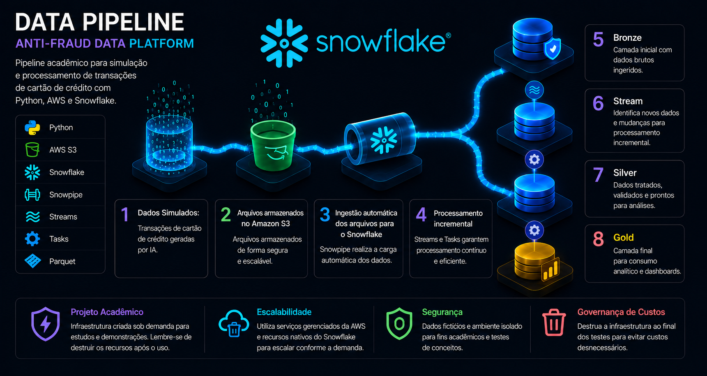
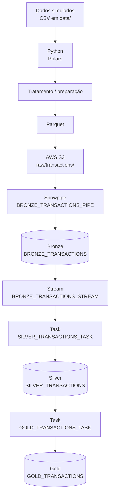
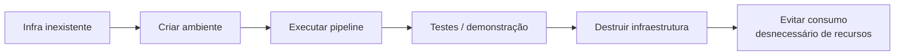

# Anti-Fraud Data Platform

Projeto **acadêmico** de engenharia de dados que demonstra um pipeline de transações de cartão com **Python + AWS S3 + Snowflake**, usando **arquitetura em camadas (Bronze → Silver → Gold)** e **processamento incremental** com Streams e Tasks.

> O foco principal está no pipeline dentro do **Snowflake**. A infraestrutura é criada, testada e destruída.

---

## Arquitetura



| Etapa | Papel | Onde está no projeto |
|---|---|---|
| 🐍 **Python** | Lê os CSVs simulados e prepara os dados | `src/upload_transactions.py`, `src/convert_transactions.py` |
| 📦 **Parquet** | Formato colunar usado na ingestão | `convert_to_parquet()` (Polars) |
| ☁️ **AWS S3** | Armazena arquivos: `landing/transactions/` (CSV) e `raw/transactions/` (Parquet) | `infrastructure/main.tf` |
| 🔄 **Snowpipe** | Ingestão automática do S3 → Bronze via notificação S3 → SQS | `sql/5_create_pipe_bronze_transactions.sql`, `src/aws_s3.py` |
| 🥉 **Bronze** | Dados brutos ingeridos + metadados (`SOURCE_FILENAME`, `INGESTION_TS`) | `sql/2_create_bronze_transactions.sql` |
| 🌊 **Stream** | Detecta apenas os novos registros (append-only) → incremental | `sql/4_create_stream.sql` |
| ⚙️ **Tasks** | Automatizam o processamento a cada 1 min e em cadeia | `sql/6_...`, `sql/7_...` |
| 🥈 **Silver** | Dados tratados e tipados (ex.: `TRN_DT` como timestamp) | `sql/3_create_silver_transactions.sql` |
| 🥇 **Gold** | Agregações por banco/mês (aprovação, ticket médio, faturamento) | `sql/7_create_task_gold_transactions.sql` |

---

## Filosofia: criar, testar e destruir



Por ser um projeto acadêmico, o ambiente é criado rapidamente para uma demonstração e removido logo em seguida. Terraform e os scripts Python cuidam disso.

**Criar** (Terraform + Snowflake + carga dos dados):

```bash
uv run src/main.py
```

**Destruir** (`terraform destroy` + `DROP DATABASE ANTI_FRAUD_DB`):

```bash
uv run src/destroy_infrastructure.py
```

> ⚠️ **Importante:** após finalizar os testes ou demonstrações, recomenda-se destruir os recursos criados para evitar consumo desnecessário de infraestrutura.

## Observacão

Este projeto foi configurado para funcionar em diferentes ambientes, permitindo sua execução tanto diretamente no **Windows** quanto através de um **Dev Container**.

| Ambiente | Descrição |
|---|---|
| **Windows** | Execução local utilizando as ferramentas instaladas no sistema operacional. |
| **Dev Container** | Execução em um ambiente isolado e padronizado utilizando Docker e VS Code. |

Escolha abaixo o ambiente desejado para visualizar as instruções de execução.

- [Computador local](#parte-0---verificar-e-instalar-o-uv)
- [Se for iniciar a partir do Dev Container clique aqui](#parte-2---download-do-dataset)

---


## Executando no computador local

## Parte 0 - Verificar e instalar o uv

1. Antes de iniciar o projeto verificar se tem instalado o `uv`

```bash
uv --version
```

Se o comando retornar uma versão, como:

```text
uv 0.x.x
```

### Windows

1. Caso o Terraform não esteja instalado, execute:

```bash
powershell -ExecutionPolicy ByPass -c "irm https://astral.sh/uv/install.ps1 | iex"
```

Após a instalação, feche e abra novamente o terminal e verifique:

```bash
uv --version
```

Deve aparecer algo parecido com:

```text
uv 0.x.x
```

### Linux

1. Caso o Terraform não esteja instalado, execute:
```bash
curl -LsSf https://astral.sh/uv/install.sh | sh
```

## Parte 1 - Verificar e instalar o Terraform

1. Antes de iniciar o projeto, verifique se o Terraform já está instalado:

```bash
terraform --version
```

Se o comando retornar uma versão, como:

```text
Terraform v1.x.x
```

Não é necessário realizar nenhuma instalação adicional.

### Windows

1. Caso o Terraform não esteja instalado, execute:

```bash
winget install Hashicorp.Terraform
```

Após a instalação, feche e abra novamente o terminal e verifique:

```bash
terraform --version
```

Deve aparecer algo parecido com:

```text
Terraform v1.x.x
```

### Linux

1. Caso o Terraform não esteja instalado, a instalação pode variar de acordo com a distribuição utilizada.

```bash
#1. Instalar dependencias
sudo apt update
sudo apt install -y gnupg software-properties-common curl

#2. Instalar chaves Hashcorp
curl -fsSL https://apt.releases.hashicorp.com/gpg | \
sudo gpg --dearmor -o /usr/share/keyrings/hashicorp-archive-keyring.gpg

#3. Adicionar repositorio
echo "deb [signed-by=/usr/share/keyrings/hashicorp-archive-keyring.gpg] https://apt.releases.hashicorp.com $(lsb_release -cs) main" | \
sudo tee /etc/apt/sources.list.d/hashicorp.list

#4. Instalar terraform
sudo apt update
sudo apt install terraform
```

Após a instalação, feche e abra novamente o terminal e verifique:

```bash
terraform --version
```

Deve aparecer algo parecido com:

```text
Terraform v1.x.x
```

**Observação: dependendo da distribuição Linux, o comando de instalação pode variar.**

## Parte 2 - Download do dataset

1. Para baixar o dataset acesse: [Dataset Transações](https://www.kaggle.com/datasets/vagnermichaell/card-credit-datasets-ready)
2. Descompacte o arquivo.
3. Crie uma pasta `data` dentro do projeto `anti-fraud-data-plataform` e coloque os arquivos csv para dentro dessa pasta.

### Caso esteja executando pelo WSL

Acesse a pasta `anti-fraud-data-plataform` do projeto clonado anteriormente e crie a pasta `data`:

```bash
mkdir -p data
```

Em seguida, copie o conteúdo da pasta card_credit_datasets_ready, localizada na pasta Downloads do Windows, para a pasta data do projeto:

```bash
# Substitua o caminho pelo caminho onde esta extraido a pasta com os csvs
cp -r "/mnt/c/<CAMINHO ONDE ESTA O ARQUIVO>/card_credit_datasets_ready/"* ./data/
```

## Parte 3 - Configuração da AWS (AWS Academy)

O projeto usa credenciais temporárias do laboratório da AWS Academy.

1. Acesse o [AWS Academy Login](https://www.awsacademy.com/vforcesite/LMS_Login).
2. Faça login com suas credenciais fornecidas pela FIAP.
3. Abra o laboratório AWS disponibilizado.
4. Inicie o laboratório, caso não esteja ativo.
5. Aguarde o ambiente AWS ficar disponível.
6. Abra as credenciais temporárias (AWS Details / CLI).
7. Copie as credenciais.

### Windows

1. No terminal do VSCODE digite:

```bash
code $HOME\.aws\credentials
```
2. Cole no arquivo de credenciais local aberto e salve (`Ctrl+S` ou `Cmd+S`).

### Linux

1. No terminal do VSCODE digite:

```bash
code ~/.aws/credentials
```
2. Cole no arquivo de credenciais local aberto e salve (`Ctrl+S` ou `Cmd+S`).

```ini
[default]
aws_access_key_id = SUA_ACCESS_KEY
aws_secret_access_key = SUA_SECRET_KEY
aws_session_token = SEU_SESSION_TOKEN
```

3. Teste a configuração:

```bash
aws s3 ls
```

Se nao der nenhum erro, significa que está funcionando, você está conectado na AWS

O perfil `default` é lido por `src/aws_credentials.py` e injetado no stage do Snowflake (`sql/1_stage_s3_transactions.sql`).

> ⚠️ As credenciais da AWS Academy são **temporárias**. Se expirarem, inicie o laboratório novamente e atualize o arquivo de credenciais. Nunca coloque chaves reais no repositório.

---

## Parte 4 - Configuração do Snowflake

1. Realize a seguinte consulta no Snowflake para descobrir sua SNOWFLAKE_ACCOUNT e SNOWFLAKE_USER:

```sql
SELECT 
    CURRENT_USER() AS SNOWFLAKE_USER,
    CONCAT(CURRENT_ORGANIZATION_NAME(), '-' , CURRENT_ACCOUNT_NAME()) AS SNOWFLAKE_ACCOUNT;

```

2. Crie um arquivo `.env` na raiz do projeto (não existe `.env` no repositório):

```env
SNOWFLAKE_USER=SEU_USUARIO
SNOWFLAKE_PASSWORD=SUA_SENHA
SNOWFLAKE_ACCOUNT=SEU_ACCOUNT_IDENTIFIER
```

A conexão (`src/snowflake_connection.py`) usa ainda, fixos no código: warehouse `LAB_WH` e role `ACCOUNTADMIN`.

> ⚠️ O arquivo `.env` contém informações sensíveis e **não deve ser enviado para o repositório** (já está no `.gitignore`).

---

## Parte 5 - Como executar

Pré-requisitos: Python 3.11, [uv](https://docs.astral.sh/uv/) e Terraform instalados.

1. Pelo Terminal navegue até a pasta `infrastructure` com o comando:

```bash
cd <CAMINHO_DO_REPOSITORIO>/anti-fraud-data-plataform/infrastructure
```

2. Digite:

```bash
terraform init
```

3. Aguarde o término, volte para a pasta principal do repositorio com:

```bash
cd <CAMINHO_DO_REPOSITORIO>/anti-fraud-data-plataform
```

4. Depois execute o comando abaixo:

```bash
# 1. instalar dependências
# Importante: estar na raiz do diretório antes de executar
uv sync

# 2. criar infra + executar o pipeline
uv run src/main.py

# 3. destruir o ambiente após o uso
uv run src/destroy_infrastructure.py
```

Para Windows o repositório tem um atalho: basta executar `run.bat` (que roda `uv run .\src\main.py`).

Sequência recomendada:

1. Configurar credenciais AWS (`~/.aws/credentials`)
2. Configurar o `.env` do Snowflake
2. Instalar e Configurar o `Terraform`
3. Instalar dependências com `uv sync`
4. Colocar os CSVs de transações (separador `;`) na pasta `data/`
5. Executar o pipeline: `uv run src/main.py`
6. Conferir as tabelas Bronze → Silver → Gold no Snowflake
7. Destruir o ambiente: `uv run src/destroy_infrastructure.py`

O que o `src/main.py` faz, em ordem:

```text
[1/4] terraform apply -auto-approve      → bucket e pastas no S3
[2/4] setup_snowflake()                  → SQL 0..5, notificação S3→SQS, SQL 6..8
[3/4] upload_transactions()              → CSVs para landing/transactions/
[4/4] process_transactions()             → CSV → Parquet → raw/transactions/
```

> ⚠️ **Importante:** após finalizar os testes ou demonstrações, recomenda-se destruir os recursos criados para evitar consumo desnecessário de infraestrutura.

## CONSUMO SNOWFLAKE

Após executar o pipeline, é possível consultar o consumo de créditos gerado pelo WAREHOUSE
e estimar o custo da execução.

O Databricks registra o consumo na tabela `SNOWFLAKE.ACCOUNT_USAGE.WAREHOUSE_METERING_HISTORY`. Como o objetivo
deste projeto é comparar o custo de processamento entre Databricks e Snowflake,
o consumo é relacionado ao preço atual encontrado na `SNOWFLAKE.ORGANIZATION_USAGE.RATE_SHEET_DAILY`.

A consulta abaixo:

- identifica o consumo do Warehouse LAB_WH nas últimas 24 horas;
- obtém o preço vigente do crédito de computação através de `RATE_SHEET_DAILY`;
- considera a taxa efetiva do serviço `WAREHOUSE_METERING`;
- calcula o custo da execução em USD com base nos créditos consumidos;

O preço utilizado corresponde ao preço mais recente registrado para a SKU `WAREHOUSE_METERING` em `SNOWFLAKE.ORGANIZATION_USAGE`.`RATE_SHEET_DAILY`. Dessa forma, o cálculo representa quanto o consumo registrado custaria considerando o preço atual do crédito de computação do Snowflake.

> **Importante:** o consumo pode levar algum tempo para aparecer no
> `SNOWFLAKE.ACCOUNT_USAGE.WAREHOUSE_METERING_HISTORY`. Portanto, uma execução recém-finalizada pode não estar
> disponível imediatamente para consulta.

```sql
WITH cte_price AS (
SELECT
    DATE,
    REGION,
    SERVICE_LEVEL,
    RATING_TYPE,
    SERVICE_TYPE,
    CURRENCY,
    EFFECTIVE_RATE
FROM SNOWFLAKE.ORGANIZATION_USAGE.RATE_SHEET_DAILY
WHERE DATE >= DATEADD(DAY, -30, CURRENT_DATE())
AND RATING_TYPE = 'COMPUTE'
AND SERVICE_TYPE = 'WAREHOUSE_METERING'
QUALIFY ROW_NUMBER() OVER (ORDER BY DATE DESC ) = 1
),
cte_usage AS (
    SELECT
       warehouse_name,
       start_time,
       credits_used 
    FROM SNOWFLAKE.ACCOUNT_USAGE.WAREHOUSE_METERING_HISTORY
    WHERE warehouse_name = 'LAB_WH'
    GROUP BY ALL
)
SELECT
    warehouse_name,
    start_time,
    credits_used,
    price.EFFECTIVE_RATE,
    credits_used * price.EFFECTIVE_RATE AS execution_cost,
    (credits_used * price.EFFECTIVE_RATE) * 30 AS monthly_estimate
FROM cte_usage usage
CROSS JOIN cte_price price
ORDER BY start_time DESC;

```

### BENCHMARK DE CONSUMO

Para este projeto foram realizadas três execuções para avaliar o consumo do
Snowflake em diferentes cenários:

1. **Execução inicial completa:** processamento de todos os arquivos disponíveis
   na AWS.
2. **Primeira execução incremental:** processamento de arquivos adicionados
   posteriormente.
3. **Segunda execução incremental:** novo processamento considerando arquivos
   adicionados posteriormente.

Os valores de consumo obtidos foram:

| Execução | Cenário | Créditos | Preço por crédito | Custo estimado | Custo mensal estimado (Custo de cada execução × 30) |
|---|---|---:|---:|---:|---:|
| 1 | Carga inicial completa | `0.051186387` | `US$ 4.65` | `US$ 0.23801669955` | `-` |
| 2 | Incremental | `0.000482890` | `US$ 4.65` | `US$ 0.002245439` | `US$ 0.067363170` |
| 3 | Incremental | `0.000965781` | `US$ 4.65` | `US$ 0.004490777` | `US$ 0.134723310` |
| 4 | **Total** | `-` | `-` | ` - ` | **US$ 0.44010317955** |

Considerando os valores observados nas três execuções, podemos estimar o custo
de processamento para um período de 30 dias.

Para isso, considera-se a execução inicial como um custo único e as duas
execuções incrementais como uma aproximação do consumo diário:

**Custo estimado em 30 dias = Execução inicial + (Incremental 1 + Incremental 2) × 30**

```text
Custo inicial:       US$ 0.23801669955
Incremental 1:       US$ 0.002245439
Incremental 2:       US$ 0.004490777
--------------------------------
Consumo diário no primeiro dia:      US$ 0.23801669955
Consumo diário nos demais dias:      US$ 0.002245439

Estimativa 30 dias:
US$ 0.23801669955 + (US$ 0.002245439 + US$ 0.004490777) × 30 = US$ 0.44010317955
```


## Parte 6 - Destruição da infraestrutura

Ao final da execução, o script perguntará se você deseja destruir toda a infraestrutura criada.

Caso ainda queira utilizar o ambiente para testes ou demonstrações, basta responder no ou manter a infraestrutura ativa.

Quando finalizar todos os testes, execute novamente o processo de destruição e responda:

```text
yes
```

Caso você tenha fechado o bat, basta digitar dentro da pasta do projeto: 

```bash
uv run .\src\destroy_infrastructure.py
```

## 🧰 Tecnologias

🐍 Python · ☁️ AWS S3 · 🏗️ Terraform · ❄️ Snowflake · 📦 Parquet · 🔄 Snowpipe · 🌊 Streams · ⚙️ Tasks · 🔧 uv

---

## 📁 Estrutura

```text
├── .devcontainer/       # Configuração do ambiente Dev Container
├── .github/             # Configurações do GitHub
├── data/                # Dados utilizados pelo projeto
├── img/                 # Imagens da documentação
├── infrastructure/      # Infraestrutura como código utilizando Terraform
├── sql/                 # Scripts SQL executados no Snowflake
├── src/                 # Scripts responsáveis pela execução do pipeline
├── tests/               # Testes automatizados
├── .env.example         # Exemplo de variáveis de ambiente
├── pyproject.toml       # Configuração e dependências do projeto
├── uv.lock              # Dependências bloqueadas pelo uv
├── run.bat              # Script de execução para Windows
└── README.md            # Documentação do projeto
```
