# PROJETO FINAL - DECISÃO DE ARQUITETURA DATABRICKS OU SNOWFLAKE

Data Integration e Pipelines

## 1 - A proposta

Vocês viram na aula como funciona um pipeline de dados de ponta a ponta: ingestão, passando por limpeza, transformação e validação. Agora quero que façam o mesmo exercício, mas com uma base que o grupo escolher.

A ideia: peguem qualquer base de dados pública que faça sentido para vocês e montem o pipeline. E aqui está a mudança mais importante desta edição: vocês não vão escolher entre Databricks e Snowflake — vão construir e evidenciar o pipeline nas duas plataformas, compará-las, e chegar a uma conclusão fundamentada sobre qual escolheriam para o caso de vocês.
 
O trabalho não é só técnico. Quero que pensem como um time de engenharia de dados que está propondo uma solução para a empresa. Isso significa responder perguntas que vão além do código: de onde vem esse dado? Quem é responsável por ele? De quanto em quanto tempo precisa atualizar? O que acontece com dados antigos? Se alguém do time sair, outra pessoa consegue manter?

### Resposta

O projeto propõe construir um pipeline de dados de transações de cartão de crédito, implementado em Databricks e Snowflake, passando por ingestão, tratamento, validação e transformação.

O objetivo é comparar as duas plataformas em aspectos como custo, processamento, escalabilidade e manutenção, chegando a uma conclusão sobre qual seria mais adequada ao cenário.

Origem: `Kaggle`, com base fictícia gerada por IA. \
Atualização: processamento incremental de novos arquivos. \
Histórico: dados antigos são mantidos para análise.

## 2 - A base de dados escolhida

Me expliquem por que escolheram essa base. Não vale “porque achamos legal” — quero entender o raciocínio. Qual problema de negócio ela resolve? Quem usaria esses dados na vida real? A fonte é confiável? Tem volume suficiente para justificar um pipeline?
Documentem a origem com cuidado:
•	Link da fonte e quem publica os dados.
•	Formato em que vem (CSV, JSON, API, Parquet...).
•	Volume: quantos registros, qual o tamanho.
•	Dicionário de dados: quais são as colunas e o que cada uma significa.
Parece burocracia, mas na vida real é a primeira coisa que qualquer auditor ou gestor de dados vai pedir.

### Resposta

Escolhemos uma base de transações de cartão de crédito por representar um cenário próximo de um problema real de prevenção a fraudes, permitindo analisar informações como valor, banco, estabelecimento, score de risco e indicador de bloqueio.
A base é fictícia e gerada com auxílio de IA, estruturada para apresentar um formato próximo ao encontrado em transações reais, sem utilizar dados reais ou sensíveis.
Ela possui aproximadamente 1,5 milhão de registros, volume suficiente para justificar a construção de um pipeline de Engenharia de Dados.

A fonte utilizada foi o Kaggle, por meio da base disponibilizada em: https://www.kaggle.com/datasets/vagnermichaell/card-credit-datasets-ready
**Formato**: CSV \
**Volume**: ~1,5 milhão de registros \
**Uso**: Simulação de análises de risco e prevenção a fraudes.

Dicionario de dados:

| Campo                      | Descrição                                                                 |
| -------------------------- | ------------------------------------------------------------------------- |
| `TRANSACTION_ID`           | Identificador único da transação                                          |
| `BANK_CODE`                | Código do banco/emissor do cartão                                         |
| `CARD_NUMBER`              | Número/token do cartão                                                    |
| `TRANSACTION_DATE`         | Data e hora da transação                                                  |
| `TRANSACTION_TYPE`         | Tipo da transação: `AUTHORIZATION`, `REVERSAL`, `REFUND`, etc.            |
| `TRANSACTION_AMOUNT`       | Valor da transação                                                        |
| `CURRENCY_CODE`            | Código da moeda ISO 4217, ex.: `BRL`, `USD`                               |
| `CARD_LIMIT_TOTAL`         | Limite total disponível contratado no cartão                              |
| `CARD_LIMIT_REMAINING`     | Limite disponível após a transação                                        |
| `PROCESSING_CODE`          | Código que identifica o tipo/processamento da transação                   |
| `REASON_CODE`              | Código de motivo, principalmente para recusas, reversões ou cancelamentos |
| `POS_NUMBER`               | Identificador do terminal/POS onde a transação ocorreu                    |
| `MERCHANT_CATEGORY_CODE`   | MCC — código da categoria de atividade do estabelecimento                 |
| `TRANSACTION_COUNTRY_CODE` | Código ISO 3166-1 do país onde ocorreu a transação                        |
| `MERCHANT_ID`              | Identificador único do estabelecimento                                    |
| `MERCHANT_NAME`            | Nome do estabelecimento                                                   |
| `MERCHANT_STATE`           | Estado/UF do estabelecimento                                              |
| `MERCHANT_CITY`            | Cidade do estabelecimento                                                 |
| `AUTHORIZATION_CODE`       | Código gerado para uma autorização aprovada                               |
| `ACQUIRER_ID`              | Identificador da instituição/adquirente que processou a transação         |
| `CARD_BRAND`               | Bandeira: `VISA`, `MASTERCARD`, `ELO`, etc.                               |
| `RISK_SCORE`               | Score de risco calculado para a transação                                 |
| `BLOCK_IND`                | Indicador de bloqueio/recusa da transação                                 |

## 3 - Databricks E Snowflake: construir, evidenciar e concluir

Esta é a espinha dorsal do projeto. Vocês vão implementar o mesmo pipeline — mesma base, mesma arquitetura Medallion (Bronze, Silver, Gold) — nas duas plataformas, e comparar com critério.

### Resposta

O mesmo pipeline foi implementado nas duas plataformas, utilizando a mesma base e a arquitetura Medallion (Bronze, Silver e Gold).
A comparação considera aspectos como arquitetura, processamento, custos, escalabilidade e manutenção, permitindo concluir qual plataforma é mais adequada ao cenário de prevenção a fraudes.

## 3.1 — A evidência (o que mostrar de cada plataforma)
•	O fluxo Bronze -> Silver -> Gold construído e executado.
•	Os quality checks rodando (e o que acontece quando um falha).
•	A consulta final na camada Gold, com resultado de negócio (ex.: SELECT na tabela agregada).
•	Prints das telas ou um vídeo curto de cada plataforma funcionando.

### Resposta

### DATABRICKS

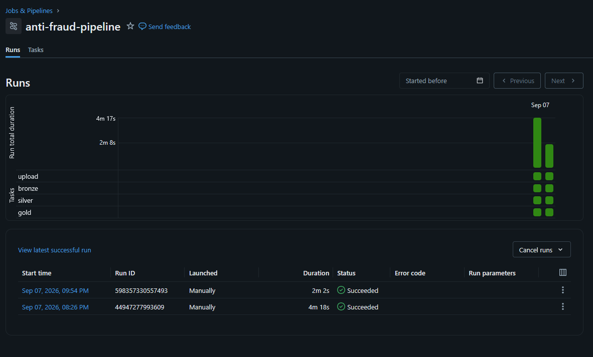
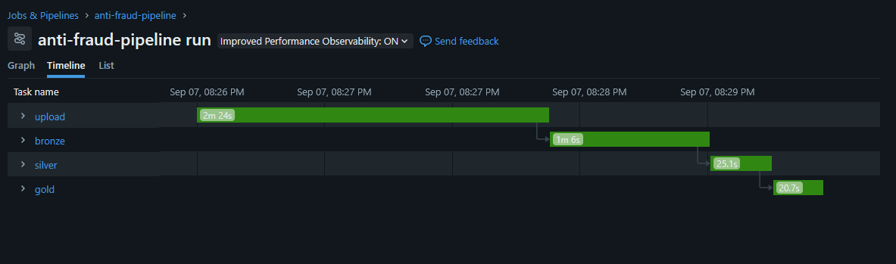

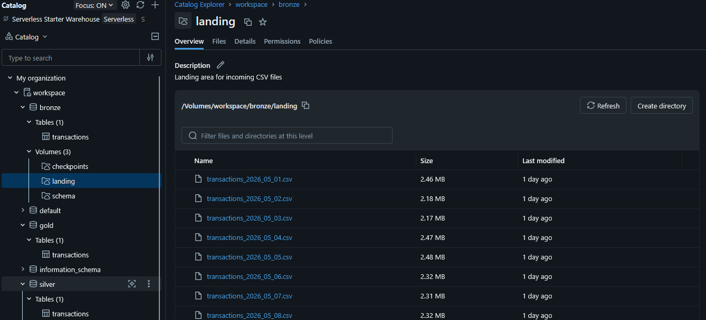
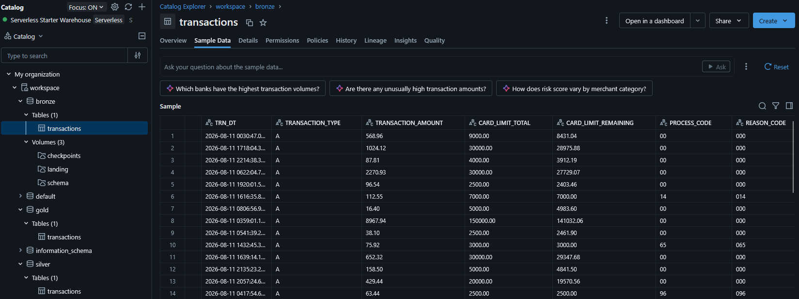
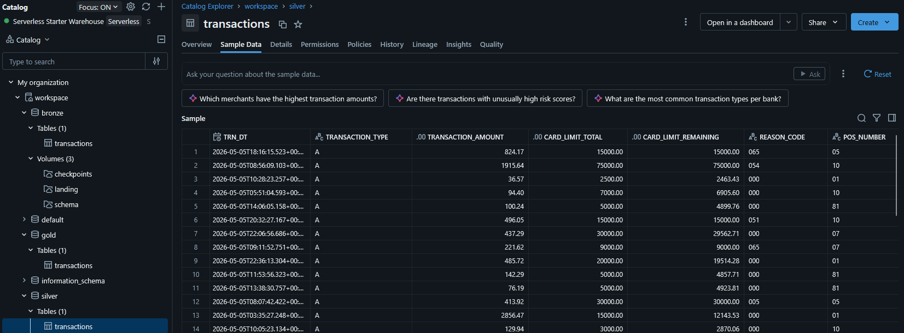
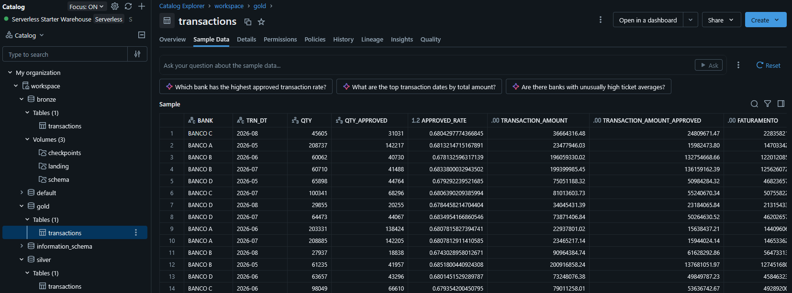

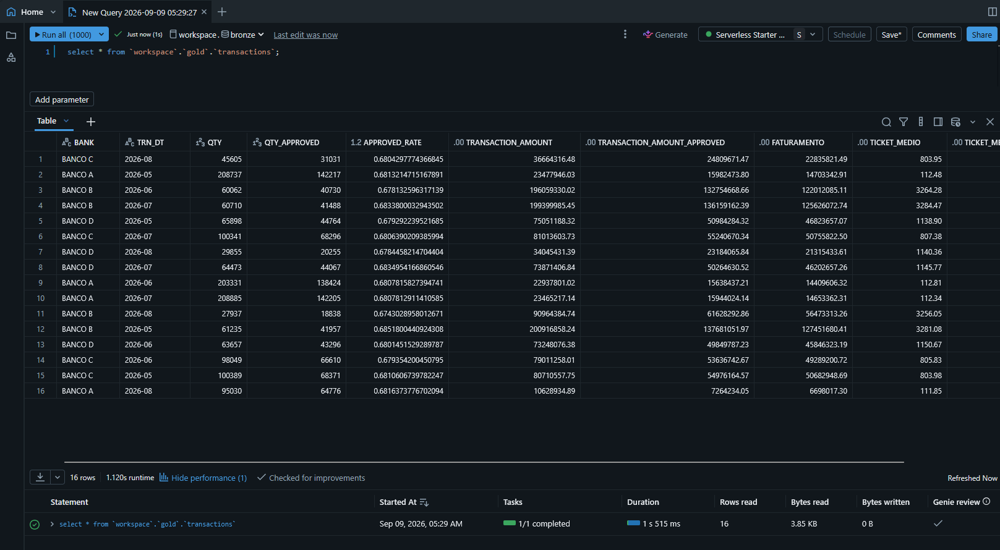

### SNOWFLAKE

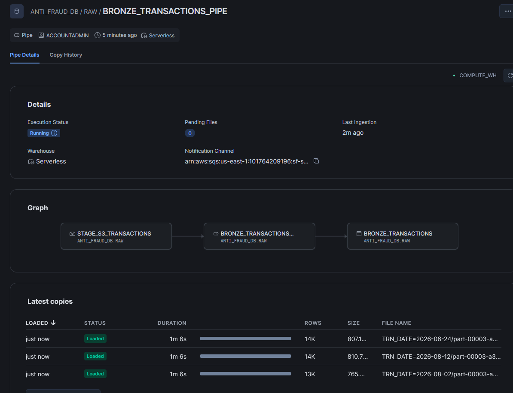
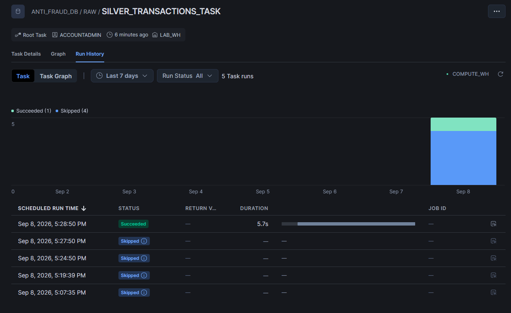
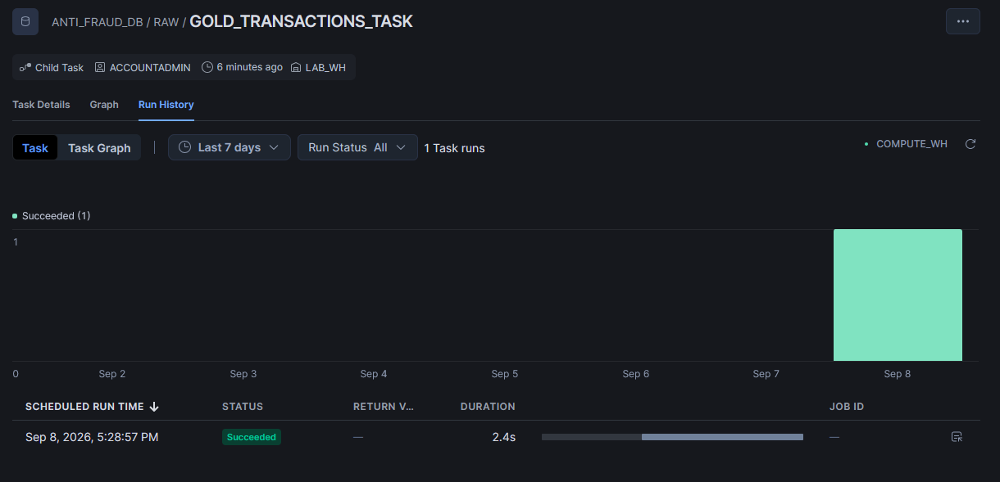


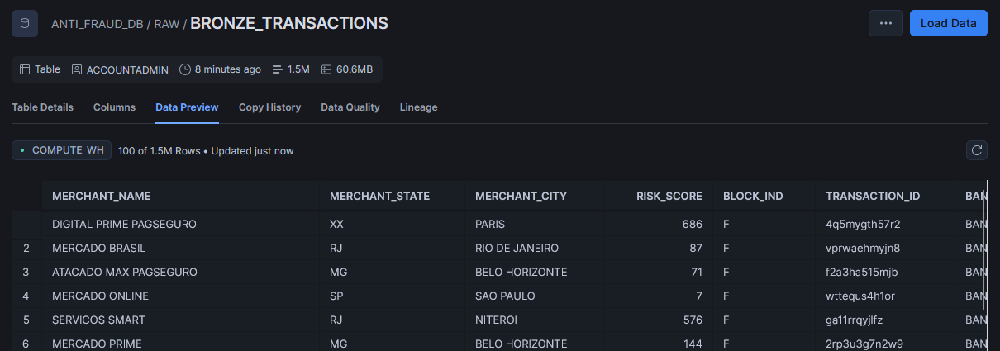
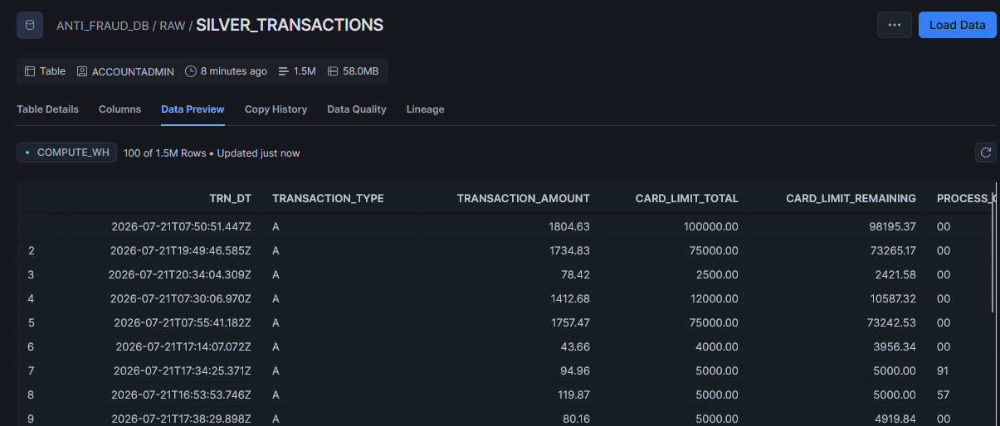
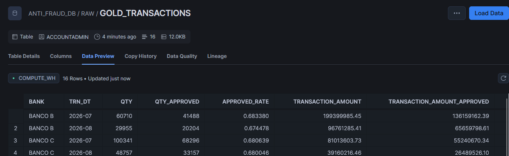


## 3.2 — A comparação (as dimensões que vocês vão avaliar)

**Facilidade de uso** -> Curva de aprendizado, interface, quão rápido vocês colocaram de pé. \
**Ingestão e transformação** ->	Como cada uma carrega e transforma os dados; o que foi mais simples. \
**Performance** -> Como cada uma se saiu no volume da sua base. \
**Governança** -> Controle de acesso, versionamento, lineage, catálogo. \
**Custo** ->	Modelo de cobrança de cada uma e a estimativa para o seu caso de uso. 

------

| Dimensão                     | Databricks                                                                                                                      | Snowflake                                                                                                                                                                  |
| ---------------------------- | ------------------------------------------------------------------------------------------------------------------------------- | -------------------------------------------------------------------------------------------------------------------------------------------------------------------------- |
| **Facilidade de uso**        | Foi a plataforma mais fácil de implementar. A interface e a integração com Python/PySpark facilitaram a construção do pipeline. | Também apresentou boa usabilidade, mas exigiu maior configuração de objetos e recursos específicos do Snowflake.                                                           |
| **Ingestão e transformação** | Utilizamos **Auto Loader** para ingestão incremental e **Spark/PySpark** para transformação dos dados.                          | Utilizamos **Snowpipe** para ingestão e **Streams/Tasks** para processamento e automação das etapas.                                                                       |
| **Performance**              | Apresentou bom desempenho no processamento da base.                                                                             | Também apresentou bom desempenho, sem diferença significativa para o volume utilizado.                                                                                     |
| **Governança**               | Oferece recursos de catálogo, controle de acesso, linhagem e organização dos dados através do Unity Catalog.                    | Possui recursos robustos de governança, controle de acesso, catálogo e auditoria, integrados ao ambiente Snowflake.                                                        |
| **Custo**                    | O custo depende principalmente dos recursos de processamento e armazenamento utilizados.                                        | O custo é baseado principalmente no consumo de créditos de computação, além de armazenamento e outros serviços. No nosso cenário, conseguimos medir o consumo do pipeline. |

### BENCHMARK DE CONSUMO DATABRICKS

Para este projeto foram realizadas três execuções para avaliar o consumo do
Databricks em diferentes cenários:

1. **Execução inicial completa:** processamento de todos os arquivos disponíveis
   no dataset do Kaggle.
2. **Primeira execução incremental:** processamento de arquivos adicionados
   posteriormente.
3. **Segunda execução incremental:** novo processamento considerando arquivos
   adicionados posteriormente.

Os valores de consumo obtidos foram:

| Execução | Cenário | DBU | Preço por DBU | Custo estimado | Custo mensal estimado (Custo de cada execução * 30) |
|---|---|---:|---:|---:|---:|
| 1 | Carga inicial completa | `0.517036357142857143` | `0.350000000000000000` | `US$ 0.180963` | ` - ` |
| 2 | Incremental | `0.248338521428571429` | `0.350000000000000000` | `US$ 0.086918` | `US$ 2.607540` |
| 3 | Incremental | `0.248338521428571429` | `0.350000000000000000` | `US$ 0.086918` | `US$ 2.607540` |
| 4 | Total | ` - ` | ` - ` | ` - ` | `US$ 5.396043` |

Considerando os valores observados nas três execuções, podemos estimar o custo
de processamento para um período de 30 dias.

Para isso, considera-se a execução inicial como um custo único e as duas
execuções incrementais como uma aproximação do consumo diário:

**Custo estimado em 30 dias = Execução inicial + (Incremental 1 + Incremental 2) × 30**

```text
Custo inicial:       US$ 0.180963
Incremental 1:       US$ 0.086918
Incremental 2:       US$ 0.086918
--------------------------------
Consumo diário no primeiro dia:      US$ 0.180963
Consumo diário nos demais dias:      US$ 0.086918

Estimativa 30 dias:
US$ 0.180963 + (US$ 0.086918 × 30) * 2 = US$ 5.396043
```

### BENCHMARK DE CONSUMO SNOWFLAKE

Para este projeto foram realizadas três execuções para avaliar o consumo do
Snowflake em diferentes cenários:

1. **Execução inicial completa:** processamento de todos os arquivos disponíveis
   na AWS.
2. **Primeira execução incremental:** processamento de arquivos adicionados
   posteriormente.
3. **Segunda execução incremental:** novo processamento considerando arquivos
   adicionados posteriormente.

Os valores de consumo obtidos foram:

| Execução | Cenário | Créditos | Preço por crédito | Custo estimado | Custo mensal estimado (Custo de cada execução × 30) |
|---|---|---:|---:|---:|---:|
| 1 | Carga inicial completa | `0.051186387` | `US$ 4.65` | `US$ 0.23801669955` | `-` |
| 2 | Incremental | `0.000482890` | `US$ 4.65` | `US$ 0.002245439` | `US$ 0.067363170` |
| 3 | Incremental | `0.000965781` | `US$ 4.65` | `US$ 0.004490777` | `US$ 0.134723310` |
| 4 | **Total** | `-` | `-` | ` - ` | **US$ 0.44010317955** |

Considerando os valores observados nas três execuções, podemos estimar o custo
de processamento para um período de 30 dias.

Para isso, considera-se a execução inicial como um custo único e as duas
execuções incrementais como uma aproximação do consumo diário:

**Custo estimado em 30 dias = Execução inicial + (Incremental 1 + Incremental 2) × 30**

```text
Custo inicial:       US$ 0.23801669955
Incremental 1:       US$ 0.002245439
Incremental 2:       US$ 0.004490777
--------------------------------
Consumo diário no primeiro dia:      US$ 0.23801669955
Consumo diário nos demais dias:      US$ 0.002245439

Estimativa 30 dias:
US$ 0.23801669955 + (US$ 0.002245439 + US$ 0.004490777) × 30 = US$ 0.44010317955
```

## 3.3 — A conclusão

Ao final, digam claramente: qual plataforma vocês escolheriam para ESTE caso de uso, e por quê. 
Não existe resposta certa universal — existe a escolha certa para o seu problema, defendida com evidência e custo. Lembrem da frase do consultor ("Depende" rsrs)

### Resposta

A escolha da plataforma depende, mas devemos considerar o caso de uso. \
Para este projeto, nossa preferência é pelo Databricks, principalmente pela facilidade na construção e orquestração de pipelines, além da integração com Python e Spark. \
Por outro lado, o Snowflake se destaca pela facilidade para trabalhar com SQL e realizar consultas, além de seus recursos de governança.
Como ambas apresentaram bom desempenho para o volume utilizado, a decisão fica principalmente entre a produtividade na construção de pipelines, onde o Databricks se destacou, e a simplicidade para consultas e análises SQL, ponto forte do Snowflake.
Para este caso de uso, escolheríamos o Databricks

## 4 - Governança e sustentabilidade

Pensem no pipeline como algo que vai rodar em produção, não como um script que roda uma vez e a gente esquece. É isto que separa um trabalho mediano de um trabalho sério.

### Resposta

O pipeline foi desenvolvido pensando em manutenção e execução contínua, e não apenas em uma execução pontual.

**Governança**: organização dos dados em Bronze, Silver e Gold, controle de acesso e utilização de recursos nativos das plataformas. \
**Manutenção**: código separado por etapas e infraestrutura gerenciada com `Terraform`, facilitando alterações e recriação do ambiente. \
**Sustentabilidade**: processamento incremental, evitando processar novamente todos os dados a cada execução e reduzindo o consumo de recursos. \
**Histórico**: os dados são mantidos para permitir análises futuras e rastreabilidade.


## Frequência de atualização

Definam de quanto em quanto tempo o pipeline rodaria, e justifiquem. Se a base é de dados financeiros, talvez precise ser diária. Se é censo demográfico, anual faz sentido. Não existe frequência certa — existe a que faz sentido para o caso de uso.

### Resposta

O pipeline seria executado diariamente, pois os dados representam transações financeiras, que precisam ser processadas com frequência para permitir o acompanhamento de riscos e possíveis fraudes.
A execução diária também é adequada ao objetivo do projeto, mantendo os dados atualizados sem a necessidade de processamento contínuo em tempo real.

## Expurgo e retenção

Os dados ficam para sempre? Tem razão para manter dados de 5 anos atrás? Existe obrigação legal de reter por X tempo? Ou faz sentido arquivar os antigos e manter só os últimos 12 meses ativos?

### Resposta
Por se tratar de transações de cartão de crédito, faz sentido manter os dados por pelo menos 4 anos, podendo ser mantidos por mais tempo conforme a necessidade do negócio e requisitos legais.
Após esse período, os dados mais antigos podem ser arquivados ou expurgados, reduzindo custos de armazenamento sem comprometer o histórico necessário para análises, auditorias e investigação de fraudes.

## Dados sensíveis

Se tiver dado sensível (CPF, nome, endereço, saúde), como vocês tratariam? Mascaramento antes de carregar? Controle de acesso? Anonimização? Mostrem que pensaram nisso — mesmo que a base escolhida não tenha, expliquem como tratariam se tivesse.

### Resposta

A base utilizada é fictícia e não contém dados pessoais reais. Entretanto, em um cenário real, informações sensíveis como CPF, nome e número do cartão seriam protegidas por meio de controle de acesso, mascaramento e/ou anonimização, conforme a necessidade de utilização.
No caso do número do cartão, por exemplo, ele poderia ser mascarado ou armazenado de forma criptografada/hash, permitindo identificar uma mesma conta sem expor o número completo.

## 5. Arquitetura

Um diagrama mostrando o fluxo: de onde o dado sai, por onde passa, onde é armazenado, como é transformado, e quem consome no final. Usem a arquitetura Medallion (Bronze -> Silver -> Gold)
O diagrama precisa ser legível: alguém que não participou do grupo tem que bater o olho e entender o fluxo. Podem usar draw.io, Lucidchart, Miro, Excalidraw, PowerPoint, ou papel e caneta escaneado — não importa a ferramenta, importa a clareza.

Indiquem no diagrama:
•	As tecnologias de cada etapa.
•	Onde ficam os quality checks.
•	A frequência com que cada parte rodaria.

Como vocês usam duas plataformas
Mostrem a arquitetura de referência (Medallion) e indiquem como cada plataforma a implementa. Pode ser um diagrama único anotado, ou um por plataforma se ajudar na comparação. - Sem ser mermaid!

### Resposta

## Arquitetura DATABRICKS

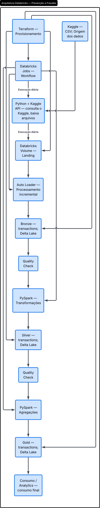


## Arquitetura SNOWFLAKE

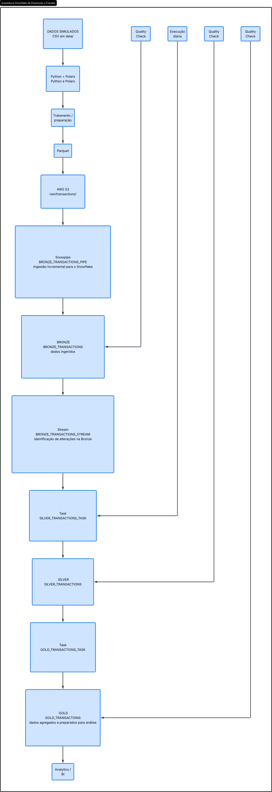


## Conclusão

A escolha da plataforma depende, mas devemos considerar o caso de uso.
Para este projeto, nossa preferência é pelo Databricks, principalmente pela facilidade na construção e orquestração de pipelines, além da integração com Python e Spark.
Por outro lado, o Snowflake se destaca pela facilidade para trabalhar com SQL e realizar consultas, além de seus recursos de governança.
Como ambas apresentaram bom desempenho para o volume utilizado, a decisão fica principalmente entre a produtividade na construção de pipelines, onde o Databricks se destacou, e a simplicidade para consultas e análises SQL, ponto forte do Snowflake.
Para este caso de uso, escolheríamos o Databricks
